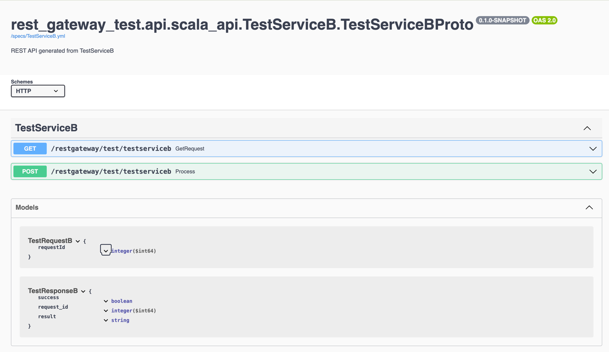

= gRPC to REST Gateway

gRPC to REST gateway generates a reverse-proxy server which converts REST HTTP API into gRPC. This project is based on work done by https://github.com/btlines/grpcgateway[grpcgateway].

== About this project

This project has two main modules, namely `grpc-rest-gateway-runtime` and `grpc-rest-gateway-code-gen`.

=== Runtime library &mdash; `grpc-rest-gateway-runtime`

Following are main classes in runtime library:

. `GrpcGatewayHandler` &mdash; base abstract class responsible for dispatch given HTTP call to corresponding function in gRPC service.
. `SwaggerHandler` &mdash; responsible for Open API yaml files and generate Swagger UI.
. Server classes to build REST server and transform gRPC response HTTP response.

=== Code generation library &mdash; `grpc-rest-gateway-code-gen`

Code generation library is responsible for reading given Protobuf files and generating corresponding implementation of `GrpcGatewayHandler`.

For example following Protobuf definition:

[source, protobuf]
----
syntax = "proto3";

package rest_gateway_test.api;

import "scalapb/scalapb.proto";
import "google/api/annotations.proto";
import "common.proto";

option java_multiple_files = false;
option java_package = "rest_gateway_test.api.java_api";
option java_outer_classname = "TestServiceBProto";
option objc_class_prefix = "TS2P";

option (scalapb.options) = {
  single_file: true
  lenses: true
  retain_source_code_info: true
  preserve_unknown_fields: false
  flat_package: true
  package_name: "rest_gateway_test.api.scala_api"
};

// Test service B
service TestServiceB {
  rpc GetRequest (rest_gateway_test.api.model.TestRequestB) returns (rest_gateway_test.api.model.TestResponseB) {
    option (google.api.http) = {
      get: "/restgateway/test/testserviceb"
    };
  }

  rpc Process (rest_gateway_test.api.model.TestRequestB) returns (rest_gateway_test.api.model.TestResponseB) {
    option (google.api.http) = {
      post: "/restgateway/test/testserviceb"
      body: "*"
    };
  }
}
----

will generate following implementation of `GrpcGatewayHandler` and Open API specification respectively:

[source, scala]
----
/*
 * Generated by GRPC-REST gateway compiler. DO NOT EDIT.
 */
package rest_gateway_test.api.scala_api

import scalapb.GeneratedMessage
import scalapb.json4s.JsonFormat
import com.improving.grpc_rest_gateway.runtime.handlers._
import io.grpc._
import io.netty.handler.codec.http.{HttpMethod, QueryStringDecoder}

import scala.concurrent.{ExecutionContext, Future}
import scalapb.json4s.JsonFormatException
import scala.util._

object TestServiceBGatewayHandler {
  private val GetGetRequestPath = "/restgateway/test/testserviceb"
  private val PostProcessPath = "/restgateway/test/testserviceb"

  def apply(channel: ManagedChannel)(implicit ec: ExecutionContext): TestServiceBGatewayHandler =
    new TestServiceBGatewayHandler(channel)
}

class TestServiceBGatewayHandler(channel: ManagedChannel)(implicit ec: ExecutionContext)
  extends GrpcGatewayHandler(channel)(ec) {
  import TestServiceBGatewayHandler._
  override val serviceName: String = "TestServiceB"
  override val specificationName: String = "TestServiceB"
  private val stub = TestServiceBGrpc.stub(channel)
  override protected val httpMethodsToUrisMap: Map[String, Seq[String]] = Map(
    "GET" -> Seq(
      GetGetRequestPath
    ),
    "POST" -> Seq(
      PostProcessPath
    )
  )

  override protected def dispatchCall(method: HttpMethod, uri: String, body: String): Future[GeneratedMessage] = {
    val queryString = new QueryStringDecoder(uri)
    val path = queryString.path
    val methodName = method.name
    if (isSupportedCall(HttpMethod.GET.name, GetGetRequestPath, methodName, path))
      get_GetRequest(mergeParameters(GetGetRequestPath, queryString))
    else if (isSupportedCall(HttpMethod.POST.name, PostProcessPath, methodName, path))
      post_Process(body)
    else Future.failed(InvalidArgument(s"No route defined for $methodName($path)"))
  }

  private def get_GetRequest(parameters: Map[String, Seq[String]]) = {
    val input = Try {
      val requestId = parameters.toLongValue("requestId")
      rest_gateway_test.api.model.TestRequestB(requestId = requestId)
    }
    Future.fromTry(input).flatMap(stub.getRequest)
  }

  private def post_Process(body: String) = {
    val input = Try(JsonFormat.fromJsonString[rest_gateway_test.api.model.TestRequestB](body))
      .recoverWith(jsonException2GatewayExceptionPF)
    Future.fromTry(input).flatMap(stub.process)
  }

}
----

[source, yaml]
----
swagger: '2.0'
info:
  version: 3.1.0
  description: 'REST API generated from TestServiceB.proto'
  title: 'TestServiceB.proto'
tags:
  - name: TestServiceB
    description: Test service B
schemes:
  - http
  - https
consumes:
  - 'application/json'
produces:
  - 'application/json'
paths:
  /restgateway/test/testserviceb:
    get:
      tags:
        - TestServiceB
      summary:
        'GetRequest'
      description:
        'Generated from rest_gateway_test.api.TestServiceB.GetRequest'
      produces:
        ['application/json']
      responses:
        200:
          description: 'Normal response'
          schema:
            $ref: "#/definitions/TestResponseB"
      parameters:
      - name: requestId
        in: query
        type: integer
        format: int64
    post:
      tags:
        - TestServiceB
      summary:
        'Process'
      description:
        'Generated from rest_gateway_test.api.TestServiceB.Process'
      produces:
        ['application/json']
      responses:
        200:
          description: 'Normal response'
          schema:
            $ref: "#/definitions/TestResponseB"
      parameters:
        - in: 'body'
          name: body
          schema:
            $ref: "#/definitions/TestRequestB"
definitions:
  TestRequestB:
    type: object
    properties:
      requestId:
        type: integer
        format: int64
  TestResponseB:
    type: object
    properties:
      success:
        type: boolean
      request_id:
        type: integer
        format: int64
      result:
        type: string
----

=== Error handling and HTTP status code mapping

gRPC-REST gateway has built in mapping between gRPC and HTTP status codes. Following is the mappings between two systems:

[width=75%]
|====
|gRPC status code |HTTP status code

|OK | OK (200)
|DATA_LOSS |Partial Content (206)
|INVALID_ARGUMENT, OUT_OF_RANGE |Bad Request (400)
|UNAUTHENTICATED |Unauthorized(401)
|PERMISSION_DENIED |Forbidden (403)
|NOT_FOUND, UNKNOWN |Not Found (404)
|UNAVAILABLE |Not Acceptable (406)
|ALREADY_EXISTS |Conflict (409)
|ABORTED, CANCELLED |Gone (410)
|FAILED_PRECONDITION |Precondition Failed (412)
|INTERNAL |Internal Server Error (500)
|UNIMPLEMENTED |Not Implemented (501)
|DEADLINE_EXCEEDED |Gateway Timeout (504)
|RESOURCE_EXHAUSTED |Insufficient Storage (507)

|====

**Note:** Any unmapped code will be mapped to `Internal Server Error (500)`.

Build `io.grpc.StatusRuntimeException` using `io.grpc.protobuf.StatusProto` to set corresponding status code and message.

[source, scala]
----
import com.google.rpc.{Code, Status}
import io.grpc.protobuf.StatusProto
import scala.concurrent.Future

// handle bad request
Future.failed(StatusProto.toStatusRuntimeException(
        Status
          .newBuilder()
          .setCode(Code.INVALID_ARGUMENT_VALUE)
          .setMessage("Invalid argument")
          .build())
)

// not found
Future.failed(StatusProto.toStatusRuntimeException(
        Status
          .newBuilder()
          .setCode(Code.NOT_FOUND_VALUE)
          .setMessage("Not foundt")
          .build())
)
----

=== Protobuf to REST mapping

Following is how Protobuf to REST mapping will work as described in the https://github.com/googleapis/api-common-protos/blob/main/google/api/http.proto[documentation].

Given following Protobuf definition:

[source,protobuf]
----
 service Messaging {
       rpc GetMessage(GetMessageRequest) returns (Message) {
         option (google.api.http) = {
           get: "/v1/messages/{message_id}/{sub.subfield}"
           additional_bindings {
              get: "/v1/messages/{message_id}"
           }
         };
       }

       rpc PostMessage(GetMessageRequest) returns (Message) {
         option (google.api.http) = {
           put: "/v1/messages/{message_id}"
           body: "sub"
         };
       }

       rpc PostMessage(GetMessageRequest) returns (Message) {
         option (google.api.http) = {
           post: "/v1/messages"
           body: "*"
         };
       }
}

message GetMessageRequest {
  message SubMessage {
    string subfield = 1;
  }
  string message_id = 1;
  SubMessage sub = 2;
}

message Message {
  string text = 1;
}
----

Following mapping defines how HTTP request supposed to be constructed.

*HTTP method:* GET +
*Path:* /v1/messages/{message_id}/{sub.subfield} +
*HTTP request:* http://localhost:7070/v1/messages/xyz/abc +
*Mapping:* Both `message_id` and `sub.subfield` are mapped as path variables

*HTTP method:* GET +
*Path:* /v1/messages/{message_id} +
*HTTP request:* http://localhost:7070/v1/messages/xyz?sub.subfield=abc +
*Mapping:* `message_id` is mapped as path variable while `sub.subfield` is mapped as query parameter

*HTTP method:* PUT +
*Path:* |http://localhost:7070/v1/messages/xyz +
*HTTP request:* http://localhost:7070/v1/messages/xyz?sub.subfield=abc [`body`: `{"subfield": "sub"}]` +
*Mapping:* `message_id` is mapped as path variable while `sub` is mapped as body payload

*HTTP method:* POST +
*Path:* /v1/messages +
*HTTP request:* http://localhost:7070/v1/messages +
*Mapping:* entire message is mapped as body payloadr

=== Run gateway server

Implement your gRPC services as per your need and run gRPC server. Gateway server can be build and run as follows:

[source, scala]
----
import com.improving.grpc_rest_gateway.runtime.server.GatewayServer
import rest_gateway_test.api.scala_api.TestServiceB.TestServiceBGatewayHandler
import scala.concurrent.ExecutionContext

implicit val ex: ExecutionContext = ??? // provide ExecutionContext
val server = GatewayServer(
      serviceHost = "localhost",
      servicePort = 8080, // assuming gRPC server is running on port 8080
      gatewayPort = 7070, // REST end point is running at port 7070
      toHandlers = channel => Seq(TestServiceBGatewayHandler(channel)),
      executor = None, // Executor is useful if you want to allocate different thread pool for REST endpoint
      usePlainText = true
    )
server.start()

// stop server once done
server.stop()

// via Typesafe config
val mainConfig = ConfigFactory.load()
val server = GatewayServer(
  config = mainConfig.getConfig("rest-gateway"),
  toHandlers = channel => Seq(TestServiceBGatewayHandler(channel)),
  executor = None
)
----

`serviceHost`, `servicePort`, `gatewayPort`, `usePlainText` can be override via environment variables `GRPC_HOST`, `GRPC_SERVICE_PORT`, `REST_GATEWAY_PORT`, and `GRPC_USE_PLAIN_TEXT` respectively.

=== Set up your project

To generate Scala classes for gateway handler and Swagger documentation add following in `plugin.sbt`:

[source, sbt]
----
addSbtPlugin("com.thesamet" % "sbt-protoc" % "1.0.7")

libraryDependencies ++= Seq(
  "com.thesamet.scalapb" %% "compilerplugin" % "0.11.17",
  "io.github.sfali23" % "grpc-rest-gateway-code-gen" % "0.6.0"
)
resolvers += "Sonatype OSS" at "https://s01.oss.sonatype.org/content/groups/public/"
----

And following in the `build.sbt`:

[source, sbt]
----
Compile / PB.targets := Seq(
  scalapb.gen() -> (Compile / sourceManaged).value / "scalapb",
  grpc_rest_gateway.gatewayGen() -> (Compile / sourceManaged).value / "scalapb",
  grpc_rest_gateway.swaggerGen() -> (Compile / resourceManaged).value / "scalapb"
)

val ScalaPb: String = scalapb.compiler.Version.scalapbVersion
val GrpcJava: String = scalapb.compiler.Version.grpcJavaVersion
libraryDependencies ++= Seq(
  "io.github.sfali23" %% "grpc-rest-gateway-runtime" % "0.6.0",
  "com.thesamet.scalapb" %% "compilerplugin" % V.ScalaPb % "compile;protobuf",
    "com.thesamet.scalapb" %% "scalapb-runtime" % V.ScalaPb % "compile;protobuf",
    "com.thesamet.scalapb" %% "scalapb-runtime-grpc" % V.ScalaPb,
    "io.grpc" % "grpc-netty" % V.GrpcJava,
    "com.thesamet.scalapb" %% "scalapb-json4s" % V.ScalaPbJson,
  "com.thesamet.scalapb.common-protos" %% "proto-google-common-protos-scalapb_0.11" % "2.9.6-0" % "compile,protobuf"
)
----

=== Run tests and sample app

`e2e` module contains test code and a sample app.

Tests can be run as follows:

[source, shell]
----
sbt "e2eJVM2_12 / test"
sbt "e2eJVM2_13 / test"
sbt "e2eJVM3 / test"
----

Sample app can be run as follows:

[source, shell]
----
# within Intellij select either of e2eJVM2_12, e2eJVM2_13, or e2eJVM3 module and run
# // TODO: figure out how to run via command line
# Following will start the application but Swagger documentation doesn't load
# sbt "e2eJVM2_13 / run"
----

Open browser and paste following URL in address bar `http://localhost:7070/docs/index.html?urls.primaryName=TestServiceB#/`, you should see Open API specification for service.

== Limitations

. Streaming calls are not supported.

