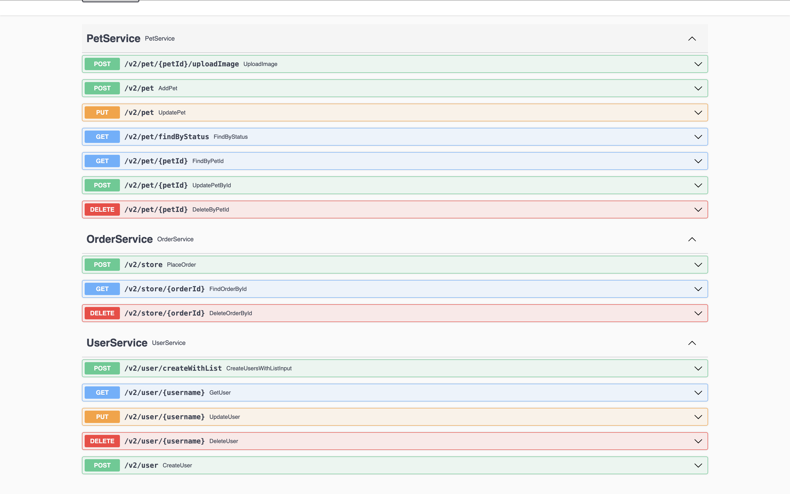

= gRPC to REST Gateway
:sectnums:
:toc:
:toclevels: 4
:app-version: 0.8.10
:scalapb-version: 0.11.8
:sbt-protoc-version: 1.0.8

gRPC to REST gateway generates a reverse-proxy server which converts REST HTTP API into gRPC. This project is based on work done by https://github.com/btlines/grpcgateway[grpcgateway].

== About this project

This project has two main modules:

. Runtime library that serves a bridge between HTTP request and gRPC server and responsible for converting to and from HTTP to gRPC.

. Code generation module which generates runtime handler(s) from given `protobuf` definition.

== Runtime implementations

Three different implementations are provided for a runtime library:

. Netty-based runtime library &mdash; `grpc-rest-gateway-runtime-netty`.
. https://pekko.apache.org/[Apache Pekko] based runtime library &mdash; `grpc-rest-gateway-runtime-pekko`.
. https://akka.io/[Akka] based runtime library &mdash; `grpc-rest-gateway-runtime-akka`.

There are three main classes in each runtime implementation along with server classes to build REST server:

. `GrpcGatewayHandler` &mdash; base abstract class / trait responsible for dispatching given HTTP request to the corresponding function in gRPC service.
. `SwaggerHandler` &mdash; responsible for Open API yaml files and generate Swagger UI.
. `GatewayServer` &mdash; responsible for starting HTTP server at the given host and port.

== Set up your project

=== Configure plugin for compiler fo code generation

To generate Scala classes for gateway handler and OpenApi documentation add following in `plugin.sbt`:

[source, sbt, subs="normal,attributes"]
----
addSbtPlugin("com.thesamet" % "sbt-protoc" % "{sbt-protoc-version}")

libraryDependencies ++= Seq(
  "com.thesamet.scalapb" %% "compilerplugin" % "{scalapb-version}",
  "io.github.sfali23" %% "grpc-rest-gateway-code-gen" % "{app-version}"
)
----

And following in the `build.sbt`:

[source, sbt, subs="normal,attributes"]
----
Compile / PB.targets := Seq(
  scalapb.gen() -> (Compile / sourceManaged).value / "scalapb",
  grpc_rest_gateway.gatewayGen(implementationType = grpc_rest_gateway.ImplementationType.Netty) -> (Compile / sourceManaged).value / "scalapb",
  grpc_rest_gateway.openApiGen() -> (Compile / resourceManaged).value / "specs"
)

// change the value of "implementationType" parameter to `grpc_rest_gateway.ImplementationType.Pekko` or
// `grpc_rest_gateway.ImplementationType.Akka` to generate Pekko or Akka based implementation

// generate code for Scala 3
Compile / PB.targets := Seq(
  scalapb.gen(scala3Sources = true) -> (Compile / sourceManaged).value / "scalapb",
  grpc_rest_gateway.gatewayGen(scala3Sources = true, implementationType = "netty") -> (Compile / sourceManaged).value / "scalapb",
  grpc_rest_gateway.openApiGen() -> (Compile / resourceManaged).value / "specs"
)

// Add the following to add openapi specs into the classpath
Compile / resourceGenerators += (Compile / PB.generate)
      .map(_.filter(_.getName.endsWith("yml")))
      .taskValue
----

=== Configure dependencies for Netty-based implementation

Add the following dependencies

[source, sbt, subs="normal,attributes"]
----
val AppVersion = "{app-version}"
val ScalaPb: String = scalapb.compiler.Version.scalapbVersion
val GrpcJava: String = scalapb.compiler.Version.grpcJavaVersion
val ScalaPbJson = "0.12.1"
libraryDependencies ++= Seq(
  "io.github.sfali23" %% "grpc-rest-gateway-runtime-netty" % AppVersion,
  "com.thesamet.scalapb" %% "compilerplugin" % ScalaPb % "compile;protobuf",
  "com.thesamet.scalapb" %% "scalapb-runtime" % ScalaPb % "compile;protobuf",
  "com.thesamet.scalapb" %% "scalapb-runtime-grpc" % ScalaPb,
  "io.grpc" % "grpc-netty" % GrpcJava,
  "com.thesamet.scalapb" %% "scalapb-json4s" % ScalaPbJson,
  "com.thesamet.scalapb.common-protos" %% "proto-google-common-protos-scalapb_0.11" % "2.9.6-0" % "compile,protobuf"
)
----

=== Configure dependencies for Pekko based implementation

Add the following dependencies:

[source, sbt, subs="normal,attributes"]
----
val AppVersion = "{app-version}"
val ScalaPb: String = scalapb.compiler.Version.scalapbVersion
val GrpcJava: String = scalapb.compiler.Version.grpcJavaVersion

lazy val root = project
  .in(file("."))
  .enablePlugins(PekkoGrpcPlugin)
  .settings(
      libraryDependencies ++= Seq(
        "io.github.sfali23" %% "grpc-rest-gateway-runtime-pekko" % AppVersion,
        "org.apache.pekko" %% "pekko-actor" % "1.1.2",
        "org.apache.pekko" %% "pekko-actor-typed" % "1.1.2",
        "org.apache.pekko" %% "pekko-stream-typed" % "1.1.2",
        "org.apache.pekko" %% "pekko-http" % "1.1.0",
        "org.apache.pekko" %% "pekko-grpc-runtime" % "1.1.1",
        "com.thesamet.scalapb.common-protos" %% "proto-google-common-protos-scalapb_0.11" % "2.9.6-0" % "compile,protobuf"
      ),
      pekkoGrpcGeneratedSources := generatedSource,
      pekkoGrpcCodeGeneratorSettings := Seq("grpc", "single_line_to_proto_string"),
      Compile / PB.targets ++= Seq(
        grpc_rest_gateway
          .gatewayGen(
              scala3Sources = true,
              implementationType = grpc_rest_gateway.ImplementationType.Pekko
           ) -> crossTarget.value / "pekko-grpc" / "main",
          grpc_rest_gateway.openApiGen() -> (Compile / resourceManaged).value / "specs"
      ),
      Compile / resourceGenerators += (Compile / PB.generate)
      .map(_.filter(_.getName.endsWith("yml")))
      .taskValue
  )
----

=== Configure dependencies for Akka based implementation

Should be similar to `Pekko` by replacing corresponding `Akka` dependencies.

== Code generation library &mdash; `grpc-rest-gateway-code-gen`

Code generation library is responsible for reading given Protobuf files and generating corresponding implementation of `GrpcGatewayHandler` based on its runtime library. The runtime handler can be generated by passing `implementationType` parameter:

There are three different plugins to generate runtime handlers, namely:

. `grpc_rest_gateway.gatewayGen(implementationType = grpc_rest_gateway.ImplementationType.Netty)` for Netty based implementation
. `grpc_rest_gateway.gatewayGen(implementationType = grpc_rest_gateway.ImplementationType.Pekko)` for Pekko based implementation
. `grpc_rest_gateway.gatewayGen(implementationType = grpc_rest_gateway.ImplementationType.Akka)` for Akka based implementation

WARNING: `Akka` implementation hasn't been tested yet due version dependency eviction in e2e testing module.

For example, the following Protobuf definition:

[source, protobuf]
----
syntax = "proto3";

package rest_gateway_test.api;

import "scalapb/scalapb.proto";
import "google/api/annotations.proto";
import "common.proto";

option java_multiple_files = false;
option java_package = "rest_gateway_test.api.java_api";
option java_outer_classname = "TestServiceBProto";
option objc_class_prefix = "TS2P";

option (scalapb.options) = {
  single_file: true
  lenses: true
  retain_source_code_info: true
  preserve_unknown_fields: false
  flat_package: true
  package_name: "rest_gateway_test.api.scala_api"
};

// Test service B
service TestServiceB {
  rpc GetRequest (rest_gateway_test.api.model.TestRequestB) returns (rest_gateway_test.api.model.TestResponseB) {
    option (google.api.http) = {
      get: "/restgateway/test/testserviceb"
    };
  }

  rpc Process (rest_gateway_test.api.model.TestRequestB) returns (rest_gateway_test.api.model.TestResponseB) {
    option (google.api.http) = {
      post: "/restgateway/test/testserviceb"
      body: "*"
    };
  }
}
----

=== Generated Open API specification:

[source, yaml]
----
openapi: 3.1.0
info:
  version: 0.1.0-SNAPSHOT
  description: "REST API generated from TestServiceB.proto"
  title: "TestServiceB.proto"
tags:
  - name: TestServiceB
    description: Test service B
paths:
  /restgateway/test/testserviceb:
    get:
      tags:
        - GetRequest
      description: Generated from GetRequest
      parameters:
        - name: requestId
          in: query
          schema:
            type: integer
            format: int64
      responses:
        "200":
          description: successful operation
          content:
            application/json:
              schema:
                $ref: "#/components/schemas/TestResponseB"
    post:
      tags:
        - Process
      description: Generated from Process
      requestBody:
        content:
          application/json:
            schema:
              $ref: "#/components/schemas/TestRequestB"
      responses:
        "200":
          description: successful operation
          content:
            application/json:
              schema:
                $ref: "#/components/schemas/TestResponseB"
components:
  schemas:
    TestRequestB:
      type: object
      properties:
        requestId:
          type: integer
          format: int64
          description: requestId
    TestResponseB:
      type: object
      properties:
        success:
          type: boolean
        request_id:
          type: integer
          format: int64
          description: request_id
        result:
          type: string
          description: result
----

=== Generated Netty based `GrpcGatewayHandler`

[source, scala]
----
/*
 * Generated by GRPC-REST gateway compiler. DO NOT EDIT.
 */
package rest_gateway_test.api.scala_api

import scalapb.GeneratedMessage
import io.grpc.ManagedChannel
import io.netty.handler.codec.http.{HttpMethod, QueryStringDecoder}

import com.improving.grpc_rest_gateway.runtime
import runtime.core.*
import runtime.handlers.*
import rest_gateway_test.api.model.TestRequestB

import scala.concurrent.{ExecutionContext, Future}
import scala.util.Try

object TestServiceBGatewayHandler {
  private val GetGetRequestPath = "/restgateway/test/testserviceb"
  private val PostProcessPath = "/restgateway/test/testserviceb"

  def apply(channel: ManagedChannel)(implicit ec: ExecutionContext): TestServiceBGatewayHandler =
    new TestServiceBGatewayHandler(channel)
}

class TestServiceBGatewayHandler(channel: ManagedChannel)(implicit ec: ExecutionContext)
    extends GrpcGatewayHandler(channel)(ec) {
  import TestServiceBGatewayHandler.*
  override val serviceName: String = "TestServiceB"
  override val specificationName: String = "TestServiceB"
  private val client = TestServiceBGrpc.stub(channel)
  override protected val httpMethodsToUrisMap: Map[String, Seq[String]] = Map(
    "GET" -> Seq(
      GetGetRequestPath
    ),
    "POST" -> Seq(
      PostProcessPath
    )
  )

  override protected def dispatchCall(method: HttpMethod, uri: String, body: String): Future[GeneratedMessage] = {
    val queryString = new QueryStringDecoder(uri)
    val path = queryString.path
    val methodName = method.name
    if (isSupportedCall(HttpMethod.GET.name, GetGetRequestPath, methodName, path))
      dispatchGetRequest(mergeParameters(GetGetRequestPath, queryString))
    else if (isSupportedCall(HttpMethod.POST.name, PostProcessPath, methodName, path))
      dispatchProcess(body)
    else Future.failed(GatewayException.toInvalidArgument(s"No route defined for $methodName($path)"))
  }

  private def dispatchGetRequest(parameters: Map[String, Seq[String]]) = {
    val input = Try {
      val requestId = parameters.toLongValue("requestId")
      TestRequestB(requestId = requestId)
    }
    toResponse(input, client.getRequest)
  }

  private def dispatchProcess(body: String) = {
    val input = parseBody[TestRequestB](body)
    toResponse(input, client.process)
  }

}
----

=== Generated Pekko based `GrpcGatewayHandler`

[source, scala]
----
/*
 * Generated by GRPC-REST gateway compiler. DO NOT EDIT.
 */
package rest_gateway_test.api.scala_api

import com.improving.grpc_rest_gateway.runtime
import runtime.core._
import runtime.handlers.GrpcGatewayHandler
import rest_gateway_test.api.model.TestRequestB

import org.apache.pekko
import pekko.grpc.GrpcClientSettings
import pekko.actor.ClassicActorSystemProvider
import pekko.http.scaladsl.server.Route
import pekko.http.scaladsl.server.Directives._

import scala.concurrent.ExecutionContext
import scala.util.Try

class TestServiceBGatewayHandler(settings: GrpcClientSettings)(implicit sys: ClassicActorSystemProvider)
    extends GrpcGatewayHandler {

  private implicit val ec: ExecutionContext = sys.classicSystem.dispatcher
  private val client = TestServiceBClient(settings)
  override val specificationName: String = "TestServiceB"

  override val route: Route = handleExceptions(exceptionHandler) {
    pathPrefix("restgateway") {
      pathPrefix("test") {
        pathPrefix("testserviceb") {
          pathEnd {
            concat(
              get {
                parameterMultiMap { queryParameters =>
                  dispatchGetRequest(queryParameters)
                }
              },
              post {
                entity(as[String]) { body =>
                  dispatchProcess(body)
                }
              }
            )
          }
        }
      }
    }
  }

  private def dispatchGetRequest(parameters: Map[String, Seq[String]]) = {
    val input = Try {
      val requestId = parameters.toLongValue("requestId")
      TestRequestB(requestId = requestId)
    }
    completeResponse(input, client.getRequest)
  }

  private def dispatchProcess(body: String) = {
    val input = parseBody[TestRequestB](body)
    completeResponse(input, client.process)
  }

}

object TestServiceBGatewayHandler {

  def apply(settings: GrpcClientSettings)(implicit sys: ClassicActorSystemProvider): GrpcGatewayHandler =
    new TestServiceBGatewayHandler(settings)

  def apply(clientName: String)(implicit sys: ClassicActorSystemProvider): GrpcGatewayHandler =
    TestServiceBGatewayHandler(GrpcClientSettings.fromConfig(clientName))
}
----

=== Generated Akka based `GrpcGatewayHandler`

Should be similar to `Pekko` with `pekko` in import statement will be replaced by `akka`.

== Setting HTTP gateway server

Implement your gRPC services as per your need and run gRPC server. Gateway server can be build and run as follows:

=== Netty-based Gateway server

[source, scala]
----
import com.improving.grpc_rest_gateway.runtime.server.GatewayServer
import rest_gateway_test.api.scala_api.TestServiceB.TestServiceBGatewayHandler
import scala.concurrent.ExecutionContext

implicit val ex: ExecutionContext = ??? // provide ExecutionContext
val server = GatewayServer(
      serviceHost = "localhost",
      servicePort = 8080, // assuming gRPC server is running on port 8080
      gatewayPort = 7070, // REST end point is running at port 7070
      toHandlers = channel => Seq(TestServiceBGatewayHandler(channel)),
      executor = None, // Executor is useful if you want to allocate different thread pool for REST endpoint
      usePlainText = true
    )
server.start()

// stop server once done
server.stop()

// via Typesafe config
val mainConfig = ConfigFactory.load()
val server = GatewayServer(
  config = mainConfig.getConfig("rest-gateway"),
  toHandlers = channel => Seq(TestServiceBGatewayHandler(channel)),
  executor = None
)
----

Alternatively `serviceHost`, `servicePort`, `gatewayPort`, `usePlainText` can be overriden via environment variables `GRPC_HOST`, `GRPC_SERVICE_PORT`, `REST_GATEWAY_PORT`, and `GRPC_USE_PLAIN_TEXT` respectively.

[source, hocon]
----
// rest-gateway config is defined as follows:

rest-gateway {
  host = "0.0.0.0"
  host = ${?GRPC_HOST}
  service-port = 8080
  service-port = ${?GRPC_SERVICE_PORT}
  gateway-port = 7070
  gateway-port = ${?REST_GATEWAY_PORT}
  use-plain-text = "true"
  use-plain-text = ${?GRPC_USE_PLAIN_TEXT}
}
----

=== Pekko based Gateway server

Providing Pekko gRPC client configuration is defined as follows:

[source, hocon]
----
pekko {
  grpc {
    client {
      pekko-gateway {
        host = "0.0.0.0" // gRPC host
        port = 8080 // grPC port
        use-tls = false
      }
    }
  }
}

// rest gateway config
rest-gateway {
  host = "0.0.0.0"
  host = ${?REST_GATEWAY_HOST}
  port = 7070
  port = ${?REST_GATEWAY_PORT}
  hard-termination-deadline = 10.seconds // For Coordinated shutdown
  hard-termination-deadline = ${?REST_GATEWAY_HARD_TERMINATION_DEADLINE}
}
----

Gateway server can be initialized as follows:

[source, scala]
----
implicit val system: ActorSystem[?] = ActorSystem[Nothing](Behaviors.empty, "grpc-rest-gateway-pekko")

val settings = GrpcClientSettings.fromConfig("pekko-gateway")
val config = system.settings.config
val restGatewayConfig = config.getConfig("rest-gateway")
GatewayServer(
  restGatewayConfig,
  TestServiceBGatewayHandler(settings)
).run()

// Or using HttSettings

GatewayServer(
  HttpSettings(restGatewayConfig),
  TestServiceBGatewayHandler(settings)
).run()
----

=== Akka based Gateway server

Providing Akka gRPC client configuration is defined as follows:

[source, hocon]
----
akka {
  grpc {
    client {
      pekko-gateway {
        host = "0.0.0.0" // gRPC host
        port = 8080 // grPC port
        use-tls = false
      }
    }
  }
}

// rest gateway config
rest-gateway {
  host = "0.0.0.0"
  port = 7070 // Gateway port
}
----

Gateway server can be initialized as follows:

[source, scala]
----
implicit val system: ActorSystem[?] = ActorSystem[Nothing](Behaviors.empty, "grpc-rest-gateway-pekko")

val settings = GrpcClientSettings.fromConfig("pekko-gateway")
val config = system.settings.config
GatewayServer(
  config.getConfig("rest-gateway"),
  TestServiceBGatewayHandler(settings)
).run()
----

== Error handling and HTTP status code mapping

gRPC-REST gateway has built in mapping between gRPC and HTTP status codes. Following is the mappings between two systems:

[width=75%]
|====
|gRPC status code |HTTP status code

|OK | OK (200)
|DATA_LOSS |Partial Content (206)
|INVALID_ARGUMENT, OUT_OF_RANGE |Bad Request (400)
|UNAUTHENTICATED |Unauthorized(401)
|PERMISSION_DENIED |Forbidden (403)
|NOT_FOUND, UNKNOWN |Not Found (404)
|UNAVAILABLE |Not Acceptable (406)
|ALREADY_EXISTS |Conflict (409)
|ABORTED, CANCELLED |Gone (410)
|FAILED_PRECONDITION |Precondition Failed (412)
|INTERNAL |Internal Server Error (500)
|UNIMPLEMENTED |Not Implemented (501)
|DEADLINE_EXCEEDED |Gateway Timeout (504)
|RESOURCE_EXHAUSTED |Insufficient Storage (507)

|====

**Note:** Any unmapped code will be mapped to `Internal Server Error (500)`.

Build `io.grpc.StatusRuntimeException` using `io.grpc.protobuf.StatusProto` to set corresponding status code and message in your implementation of `gRPC` server.

[source, scala]
----
import com.google.rpc.{Code, Status}
import io.grpc.protobuf.StatusProto
import scala.concurrent.Future

// handle bad request
Future.failed(StatusProto.toStatusRuntimeException(
        Status
          .newBuilder()
          .setCode(Code.INVALID_ARGUMENT_VALUE)
          .setMessage("Invalid argument")
          .build())
)

// not found
Future.failed(StatusProto.toStatusRuntimeException(
        Status
          .newBuilder()
          .setCode(Code.NOT_FOUND_VALUE)
          .setMessage("Not found")
          .build())
)
----

== Protobuf to REST mapping

Following is how Protobuf to REST mapping will work as described in the https://github.com/googleapis/api-common-protos/blob/main/google/api/http.proto[documentation].

Given following Protobuf definition:

[source,protobuf]
----
 service Messaging {
       rpc GetMessage(GetMessageRequest) returns (Message) {
         option (google.api.http) = {
           get: "/v1/messages/{message_id}/{sub.subfield}"
           additional_bindings {
              get: "/v1/messages/{message_id}"
           }
         };
       }

       rpc PostMessage(GetMessageRequest) returns (Message) {
         option (google.api.http) = {
           put: "/v1/messages/{message_id}"
           body: "sub"
         };
       }

       rpc PostMessage(GetMessageRequest) returns (Message) {
         option (google.api.http) = {
           post: "/v1/messages"
           body: "*"
         };
       }
}

message GetMessageRequest {
  message SubMessage {
    string subfield = 1;
  }
  string message_id = 1;
  SubMessage sub = 2;
}

message Message {
  string text = 1;
}
----

Following mapping defines how HTTP request supposed to be constructed.

*HTTP method:* GET +
*Path:* /v1/messages/{message_id}/{sub.subfield} +
*HTTP request:* http://localhost:7070/v1/messages/xyz/abc +
*Mapping:* Both `message_id` and `sub.subfield` are mapped as path variables

*HTTP method:* GET +
*Path:* /v1/messages/{message_id} +
*HTTP request:* http://localhost:7070/v1/messages/xyz?sub.subfield=abc +
*Mapping:* `message_id` is mapped as path variable while `sub.subfield` is mapped as query parameter

*HTTP method:* PUT +
*Path:* |http://localhost:7070/v1/messages/xyz +
*HTTP request:* http://localhost:7070/v1/messages/xyz?sub.subfield=abc [`body`: `{"subfield": "sub"}]` +
*Mapping:* `message_id` is mapped as path variable while `sub` is mapped as body payload

*HTTP method:* POST +
*Path:* /v1/messages +
*HTTP request:* http://localhost:7070/v1/messages +
*Mapping:* entire message is mapped as body payload

== Run tests and sample app

`e2e` module contains test code and a sample app.

Tests can be run as follows:

[source, shell]
----
sbt "nettyJVM212Test"
sbt "nettyJVM213Test"
sbt "nettyJVM3Test"
sbt "pekkoJVM212Test"
sbt "pekkoJVM213Test"
sbt "pekkoJVM3Test"
----

Sample app can be run as follows:

[source, shell]
----
# For Scala 2.12
sbt "nettyJVM212Run"
sbt "pekkoJVM212Run"

# # For Scala 2.13
sbt "nettyJVM213Run"
sbt "pekkoJVM213Run"

# For Scala 3
sbt "nettyJVM3Run"
sbt "pekkoJVM3Run"
----

Open browser and paste following URL in address bar `http://localhost:7070`, you should see Open API specification for service.

image::media/swagger.png[]

== Reference implementation using Apache Pekko

A reference implementation of https://petstore.swagger.io/[Swagger petstore] is attempted https://github.com/sfali/petstore-grpc[here]. Follow steps described in https://github.com/sfali/petstore-grpc/blob/main/README.adoc#how-to-run-service[README] file to run reference implementation.

Open browser and paste following URL in address bar `http://localhost:7070`, you should see Open API specification for petstore service.

Following is corresponding https://github.com/sfali/petstore-grpc/blob/main/api/src/main/protobuf/petstore/petstore.proto[proto] file.

== Limitations

. Streaming calls are not supported.
. HTTP headers are not currently supported
